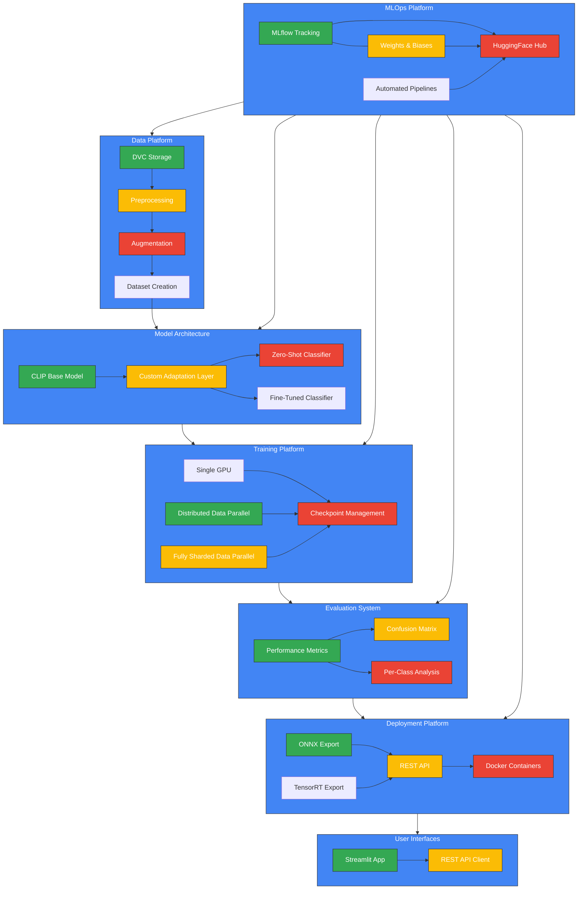
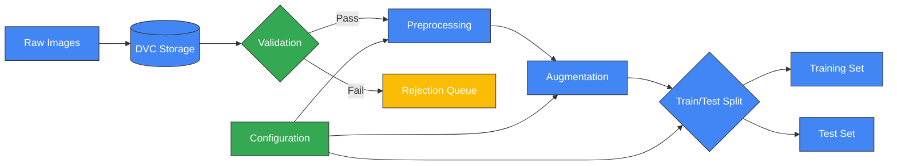
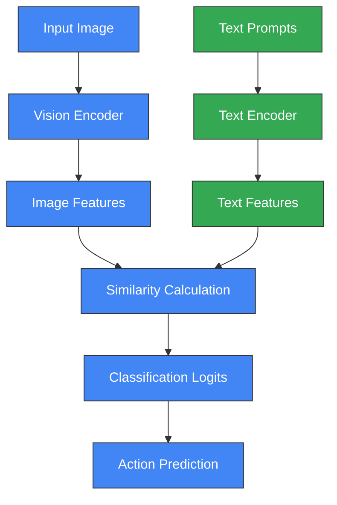
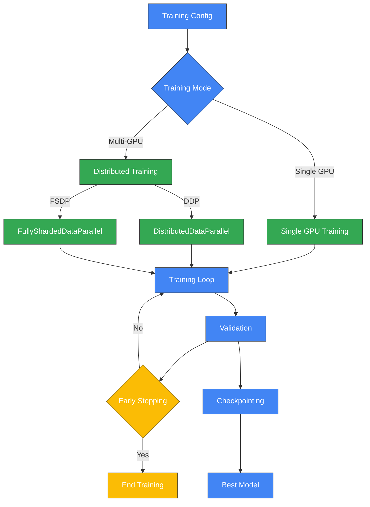
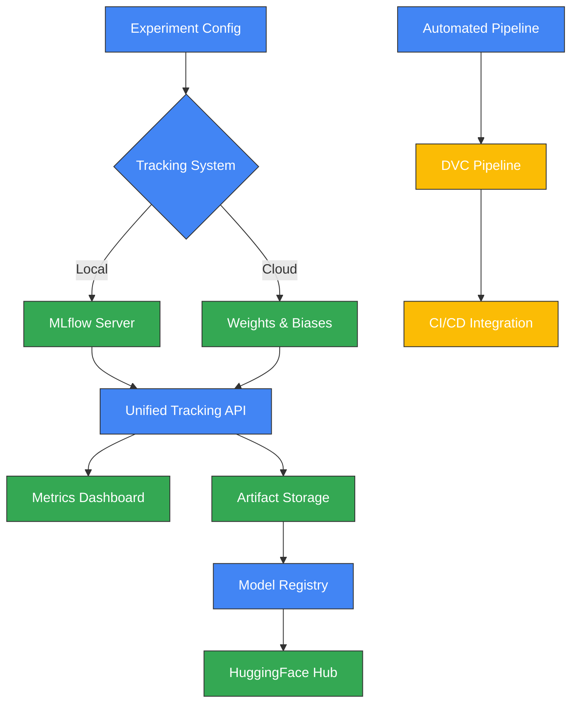
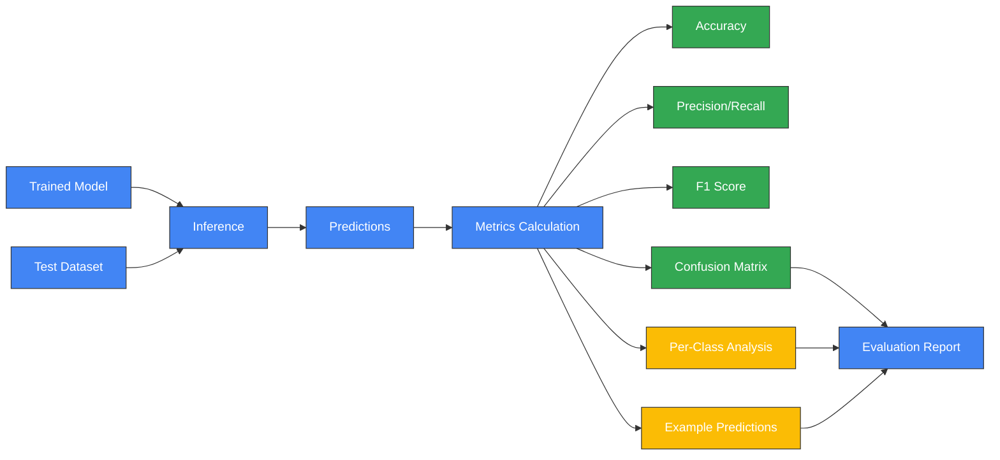
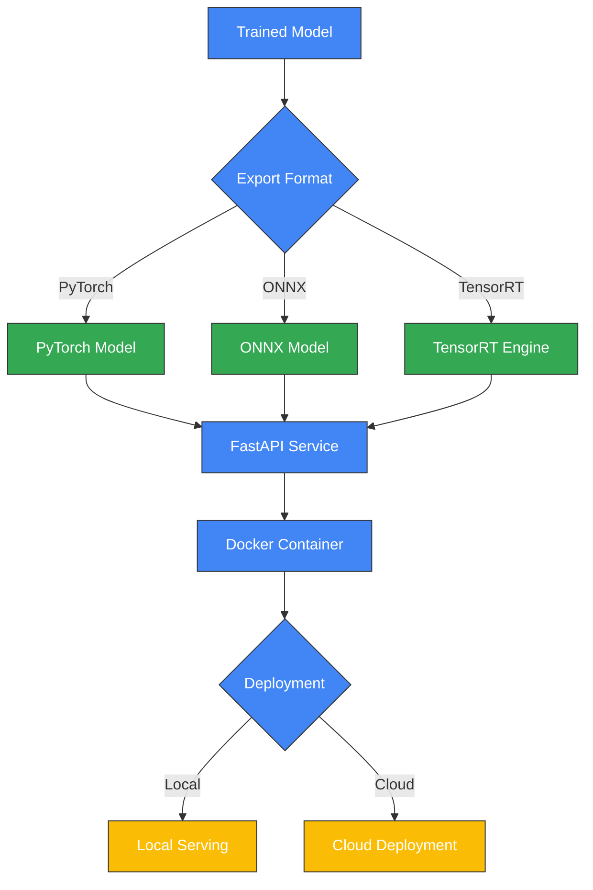
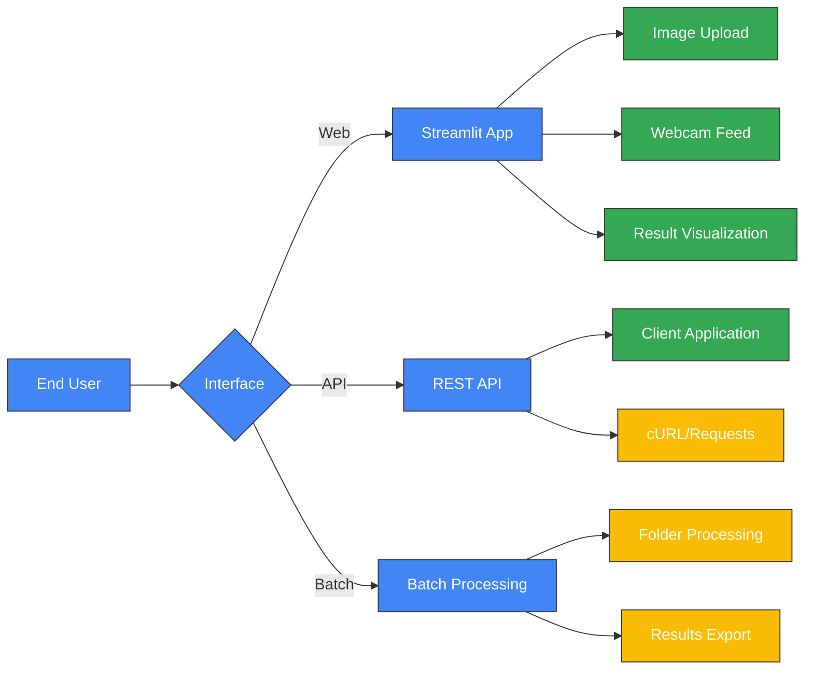

# CLIP HAR System Architecture

## Overview

The CLIP HAR system provides an end-to-end solution for Human Action Recognition using OpenAI's CLIP (Contrastive Language-Image Pre-training) model. By leveraging CLIP's powerful multi-modal capabilities, our system can recognize human actions from images with high accuracy in both zero-shot and fine-tuned settings.

## System Architecture

## Component Details

### 1. Data Platform

The Data Platform manages dataset versioning, preprocessing, and augmentation, ensuring consistent data quality throughout the machine learning lifecycle.

**Key Features:**
- **Data Version Control**: Tracks dataset changes using DVC
- **Automated Validation**: Ensures data quality and consistency
- **Configurable Preprocessing**: Custom pipelines for different datasets
- **Advanced Augmentation**: Improves model robustness and generalization

### 2. Model Architecture

The Model Architecture leverages CLIP's powerful multi-modal representation capabilities for human action recognition.

**Key Features:**
- **CLIP Integration**: Utilizes CLIP's vision and text encoders
- **Zero-Shot Capability**: Classifies actions without labeled examples
- **Custom Prompting**: Optimized text prompts for action recognition
- **Fine-Tuning Options**: Parameter-efficient tuning strategies

### 3. Training Platform

The Training Platform orchestrates model training across various hardware configurations, from single GPUs to distributed clusters.

**Key Features:**
- **Flexible Deployment**: Single-GPU, DDP, and FSDP training modes
- **Mixed Precision**: Accelerated training with FP16/BF16
- **Automated Checkpointing**: Saves best models based on validation metrics
- **Early Stopping**: Prevents overfitting and saves compute resources

### 4. MLOps Platform

The MLOps Platform integrates experiment tracking, model versioning, and pipeline automation for a seamless development workflow.

**Key Features:**
- **Dual Tracking**: Simultaneous MLflow and W&B experiment tracking
- **Unified API**: Consistent interface for multiple tracking backends
- **Automated Pipelines**: End-to-end training and evaluation workflows
- **HuggingFace Integration**: Seamless model sharing and collaboration

### 5. Evaluation System

The Evaluation System provides comprehensive model assessment with detailed metrics and visualizations.

**Key Features:**
- **Comprehensive Metrics**: Accuracy, precision, recall, F1 score
- **Visual Analysis**: Confusion matrices and performance plots
- **Per-Class Breakdown**: Detailed analysis by action category
- **Example Visualization**: Success and failure case examination

### 6. Deployment Platform

The Deployment Platform optimizes models for production and serves them through various interfaces.

**Key Features:**
- **Multiple Export Formats**: PyTorch, ONNX, and TensorRT
- **Fast Inference API**: High-performance serving with FastAPI
- **Containerization**: Docker images for consistent deployment
- **Deployment Options**: Local and cloud deployment strategies

### 7. User Interfaces

The User Interfaces provide interactive ways to interact with the model.

**Key Features:**
- **Streamlit Application**: Interactive web interface for model testing
- **REST API**: Programmatic access for integration
- **Real-time Processing**: Live webcam action recognition
- **Batch Processing**: Process multiple images at once

## Technology Stack

- **Framework**: PyTorch, HuggingFace Transformers
- **Training**: Distributed training with DDP and FSDP
- **Experiment Tracking**: MLflow and Weights & Biases
- **Data Management**: DVC for versioning
- **Deployment**: Docker, FastAPI, ONNX Runtime
- **UI**: Streamlit

## Implementation Benefits

- **Modular Design**: Components can be used independently or together
- **Scalable Training**: From single GPU to multi-node clusters
- **Production-Ready**: Optimized for deployment in various environments
- **Extensible**: Easy to adapt for new action classes or domains
- **Comprehensive MLOps**: Full lifecycle management from data to deployment 