# CLIP HAR System Architecture

This document provides a comprehensive overview of the CLIP HAR (Human Action Recognition) system architecture from an MLOps perspective.

## System Overview

The CLIP HAR system implements a modern MLOps architecture that spans the entire ML lifecycle from data preparation to production deployment, centered around the CLIP (Contrastive Language-Image Pre-training) model for human action recognition.

### High-Level Architecture

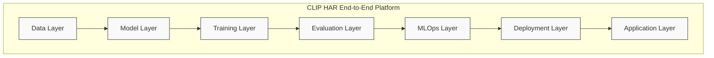

## Layered Architecture

### 1. Data Layer

The data layer handles dataset management, version control, preprocessing, and augmentation pipelines.

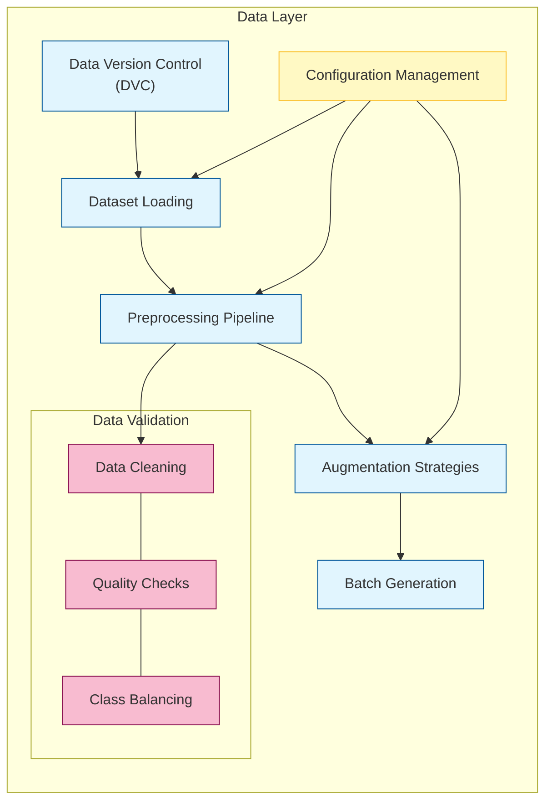

### 2. Model Layer

The model layer defines the neural network architecture, incorporating CLIP's vision and language components.

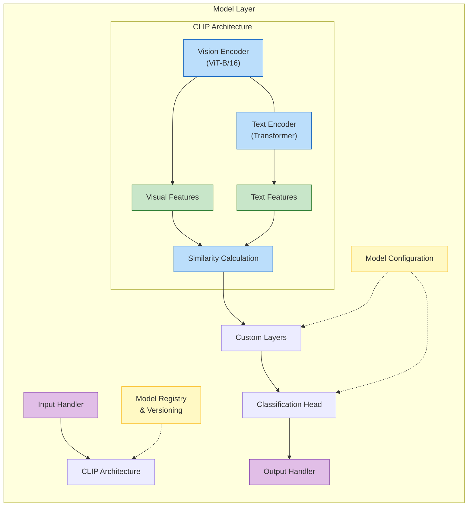

### 3. Training Layer

The training layer orchestrates model training with support for distributed execution and experiment tracking.

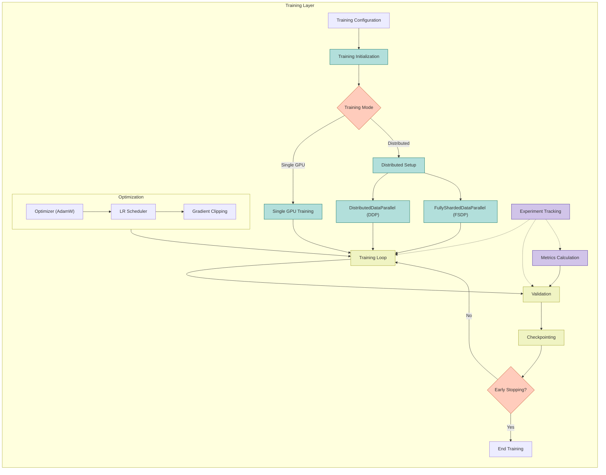

### 4. Evaluation Layer

The evaluation layer assesses model performance with comprehensive metrics and visualizations.

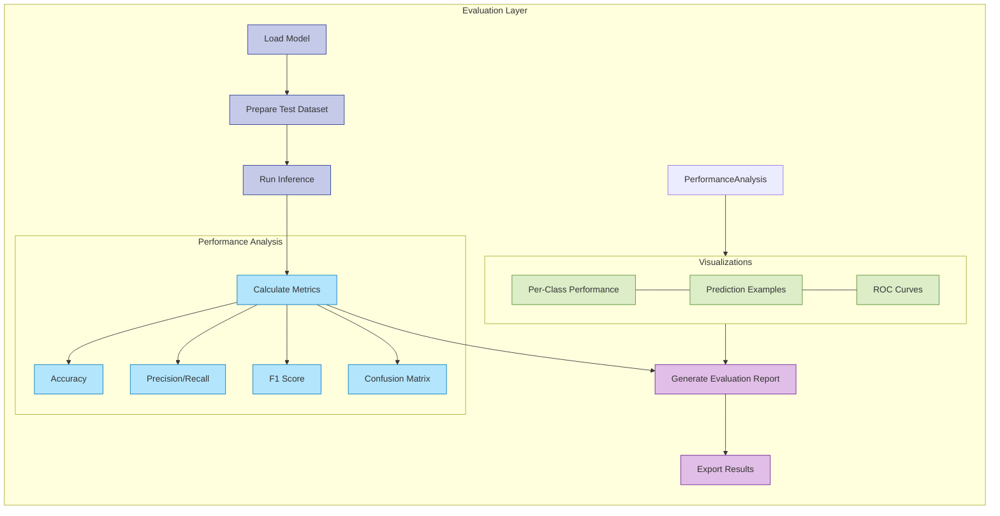

### 5. MLOps Layer

The MLOps layer implements experiment tracking, model versioning, and pipeline automation.

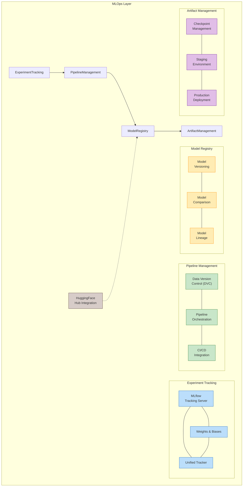

### 6. Deployment Layer

The deployment layer handles model export, optimization, and serving infrastructure.

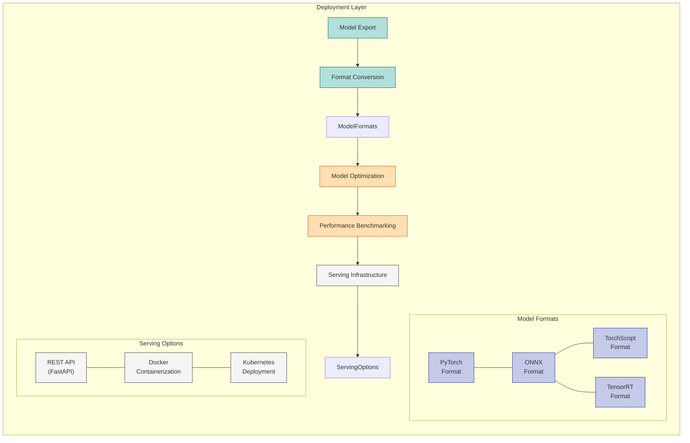

### 7. Application Layer

The application layer provides user interfaces and API clients for model interaction.

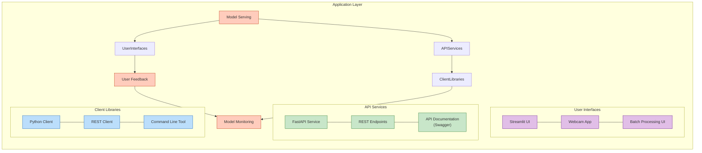

## Technology Stack

The CLIP HAR project leverages a comprehensive technology stack for MLOps:

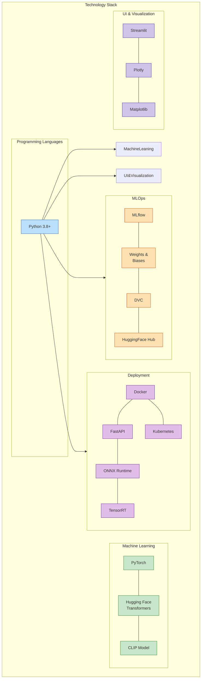

## Data Flow

The following diagram illustrates the complete data flow through the system:

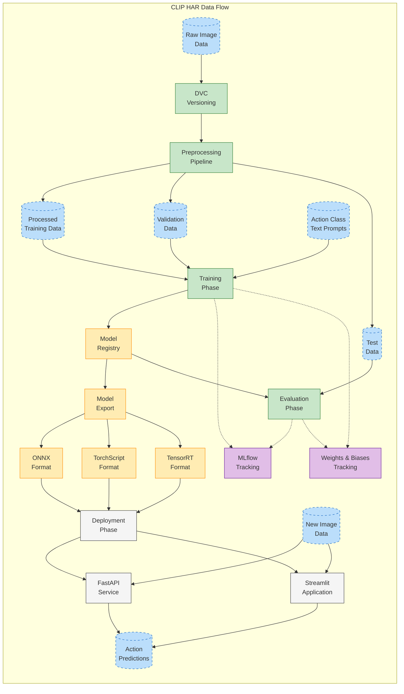

## Deployment Architecture

The deployment architecture shows how the system components are deployed in production:

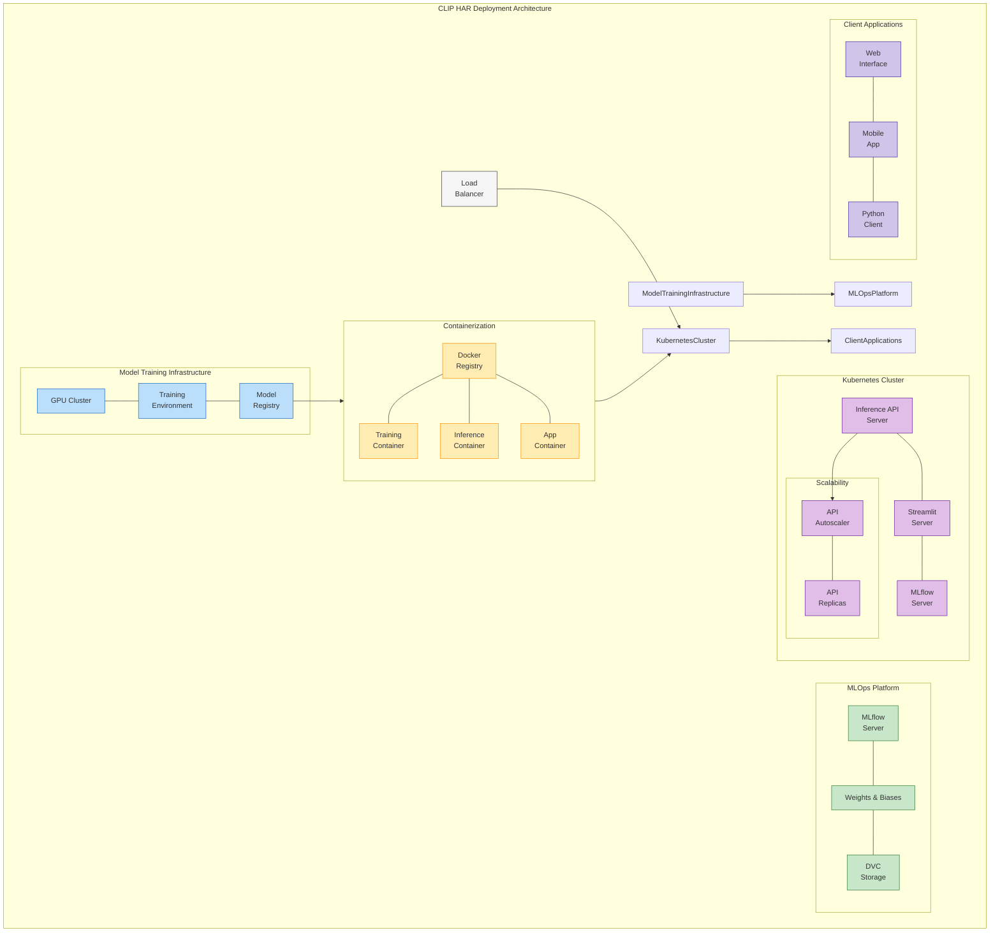

## CLIP HAR Model Architecture

The specific architecture of the CLIP HAR model:

```mermaid
flowchart TB
    subgraph "CLIP HAR Model Architecture"
    
    subgraph "Input"
    ImageInput["Image Input"] --- TextPrompts["Text Prompts<br>(Action Classes)"]
    end
    
    subgraph "CLIP Encoders"
    ImageInput --> VisionEncoder["Vision Transformer<br>(ViT-B/16)"]
    TextPrompts --> TextEncoder["Text Encoder<br>(Transformer)"]
    
    VisionEncoder --> ImageEmbedding["Image<br>Embedding"]
    TextEncoder --> TextEmbedding["Text<br>Embeddings"]
    end
    
    subgraph "Similarity Calculation"
    ImageEmbedding --> Normalize1["L2<br>Normalization"]
    TextEmbedding --> Normalize2["L2<br>Normalization"]
    
    Normalize1 --> CosineSim["Cosine<br>Similarity"]
    Normalize2 --> CosineSim
    end
    
    subgraph "Classification"
    CosineSim --> LogitScale["Temperature<br>Scaling"]
    LogitScale --> Softmax["Softmax"]
    Softmax --> Predictions["Action<br>Predictions"]
    end
    
    classDef inputNode fill:#bbdefb,stroke:#1565c0,stroke-width:1px;
    classDef encoderNode fill:#c8e6c9,stroke:#2e7d32,stroke-width:1px;
    classDef embeddingNode fill:#ffe0b2,stroke:#e65100,stroke-width:1px;
    classDef simNode fill:#e1bee7,stroke:#6a1b9a,stroke-width:1px;
    classDef classNode fill:#d1c4e9,stroke:#4527a0,stroke-width:1px;
    
    class ImageInput,TextPrompts inputNode;
    class VisionEncoder,TextEncoder encoderNode;
    class ImageEmbedding,TextEmbedding embeddingNode;
    class Normalize1,Normalize2,CosineSim simNode;
    class LogitScale,Softmax,Predictions classNode;
    end
```

## Complete System Integration

The integration of all components in the CLIP HAR project:

```
+---------------------+     +------------------------+     +----------------+
|  Data Management    |     | Training Infrastructure|     |  CI/CD Pipeline|
|                     |     |                        |     |                |
| +-------+  +------+ |     | +------+  +---------+ |     | +-----+  +---+ |
| |Raw Data|->|DVC   |=|=====>|Dev   |--|Training | |     | |Git  |->|CI | |
| +-------+  |Version| |     | |Env  |  |Env      | |     | |Repo |  |Flow| |
|            |Control|=|=====>+------+  +---------+ |     | +-----+  +---+ |
|            +------+ |     |            |          |     |            |   |
|               |     |     |            |          |     |            v   |
|               v     |     |            v          |     |        +------+|
|          +--------+ |     |         +--------+    |     |        |Tests | |
|          |Data    | |     |         |Experiment|  |     |        +------+|
|          |Process | |     |         |Tracking  |  |     |            |   |
|          +--------+ |     |         +--------+    |     |            v   |
+---------------------+     +------------------------+     |     +---------+|
        |                            |                     |     |Build    ||
        |                            |                     |     |Images   ||
        |                            |                     |     +---------+|
        |                            |                     +----------------+
        |                            |                             |
        |                            |                             |
        v                            v                             v
+---------------------+     +------------------------+     +----------------+
|  Production Env     |<----|Monitoring & Observ.    |     |                |
|                     |     |                        |     |                |
| +-------+  +------+ |     | +------+  +---------+ |     |                |
| |K8s    |--|Load  | |     | |Model |--|Service  | |     |                |
| |Cluster|  |Balancer| |     | |Metrics|  |Metrics  | |     |                |
| +-------+  +------+ |     | +------+  +---------+ |     |                |
|     |         |     |     |               |       |     |                |
|     v         v     |     |               v       |     |                |
| +--------------+    |     |         +---------+   |     |                |
| |API Endpoints |    |     |         |Alerting |   |     |                |
| +--------------+    |     |         |System   |   |     |                |
|     ^               |     |         +---------+   |     |                |
+-----|---------------+     +------------------------+     |                |
      |                                 |                  |                |
      |                                 +------------------|----------------+
      v                                                    |
+------------+                                             |
|  End Users |                                             |
+------------+                                             |
                                                           |
     +-----------------------------------------------------|
     |
     v
Feedback Loop
```

## CI/CD Pipeline

The CI/CD pipeline automates testing, building, and deployment processes for the CLIP HAR project.

```
                         +----------------+
                         |  Code Changes  |
                         +-------+--------+
                                 |
                                 v
                        +------------------+
                        | GitHub Repository|
                        +--------+---------+
                           /            \
                          /              \
                         v                v
               +----------------+  +-------------------+
               | Pull Request   |  | Push to Main      |
               | Event          |  | Event             |
               +-------+--------+  +--------+----------+
                       |                     |
                       v                     |
               +----------------+            |
               | Code Quality   |            |
               | Checks         |            |
               +-------+--------+            |
                       |                     |
                       v                     |
               +----------------+            |
               | Unit Tests     |            |
               +-------+--------+            |
                       |                     |
                       v                     v
               +----------------+    +-------------------+
               | Integration    |--->| Build Workflow    |
               | Tests          |    +--------+----------+
               +----------------+             |
                                        /-----+-----\
                                       /             \
                                      v               v
                         +----------------+  +------------------+
                         | Build Training |  | Build App        |
                         | Container      |  | Container        |
                         +-------+--------+  +--------+---------+
                                 |                     |
                                 v                     v
                         +----------------+  +------------------+
                         | Push to        |  | Push to          |
                         | Registry       |  | Registry         |
                         +-------+--------+  +--------+---------+
                                 |                     |
                                 \---------+-----------/
                                           |
                                           v
                                 +-------------------+
                                 | Deploy to         |
                                 | Development       |
                                 +--------+----------+
                                          |
                                          v
                                 +-------------------+
                                 | Evaluate          |
                                 | Performance       |
                                 +--------+----------+
                                     /        \
                                    /          \
                                   v            v
                        +-----------------+  +------------------+
                        | Deploy to       |  | Notify           |
                        | Production      |  | Team             |
                        +-----------------+  +------------------+
```

## Kubernetes Deployment Workflow

The Kubernetes deployment workflow for the CLIP HAR system:

```
+--------------------------------------+
|     Kubernetes Deployment Workflow   |
+--------------------------------------+
         |
         v
+------------------+     +------------------+     +------------------+
| Infrastructure   |     | Storage          |     | Deployments      |
|                  |     |                  |     |                  |
| K8s Cluster      |     | Persistent       |     | Inference API    |
| CLIP HAR Namespace|---->| Volumes         |---->| Deployment       |
| ConfigMaps       |     | PV Claims        |     | Streamlit UI     |
| & Secrets        |     | Model Storage    |     | MLflow Deployment|
+------------------+     +------------------+     +------------------+
                                                         |
                                                  /------+------\
                                                 /               \
                                                v                 v
                                +------------------+     +------------------+
                                | Ingress &        |     | Scaling &        |
                                | Networking       |     | Updates          |
                                |                  |     |                  |
                                | Ingress Controller|    | Horizontal Pod   |
                                | TLS Termination  |     | Autoscaler       |
                                | Path-based       |     | Rolling Updates  |
                                | Routing          |     | Health Checks    |
                                +------------------+     +------------------+
                                                                |
                                                                v
                                                        +------------------+
                                                        | Monitoring       |
                                                        |                  |
                                                        | Prometheus       |
                                                        | Grafana          |
                                                        | Alert Manager    |
                                                        +------------------+
```

## Model Performance Optimization Pipeline

The model optimization pipeline improves inference performance:

```
                      +---------------------------+
                      | Trained PyTorch Model     |
                      +-----------+---------------+
                                  |
                                  v
                      +--------------------------+
                      | Export to ONNX           |
                      +-----------+--------------+
                                  |
                                  v
                      +--------------------------+
                      | ONNX Optimization        |
                      +-----------+--------------+
                                  |
                                  v
                      +--------------------------+
                      | ONNX Quantization        |
                      +-----------+--------------+
                                  |
                                  v
                      +--------------------------+
                      | TensorRT Conversion      |------------+
                      +-----------+--------------+            |
                                  |                           |
                                  v                           v
                      +--------------------------+   +-------------------+
                      | TensorRT Calibration     |   | CPU Deployment    |
                      +-----------+--------------+   +--------+----------+
                                  |                           |
                                  v                           |
                      +--------------------------+            |
                      | GPU Deployment           |            |
                      +-----------+--------------+            |
                                  |                           |
                                  \-----------+---------------/
                                              |
                                              v
                                  +--------------------------+
                                  | Benchmarking             |
                                  |                          |
                                  | Latency Testing          |
                                  | Throughput Testing       |
                                  | Memory Usage             |
                                  | Power Efficiency         |
                                  +-----------+--------------+
                                              |
                                              v
                                  +--------------------------+
                                  | Optimization Report      |
                                  +--------------------------+
```

## Conclusion

The CLIP HAR system architecture provides a comprehensive ML platform for human action recognition using CLIP, with full MLOps capabilities for experiment tracking, model versioning, and deployment. The modular design enables flexibility, scalability, and maintainability across the entire ML lifecycle.
