# CLIP HAR System Architecture

This document provides a comprehensive overview of the CLIP HAR (Human Action Recognition) project architecture, detailing the various components and their interactions.

## System Overview

The CLIP HAR system is designed as a modular, layered architecture to support the complete lifecycle of developing, training, evaluating, and deploying human action recognition models based on CLIP (Contrastive Language-Image Pre-training).

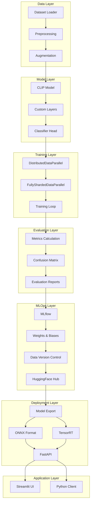

## Layer Details

### 1. Data Layer

The data layer manages dataset acquisition, preprocessing, and augmentation.

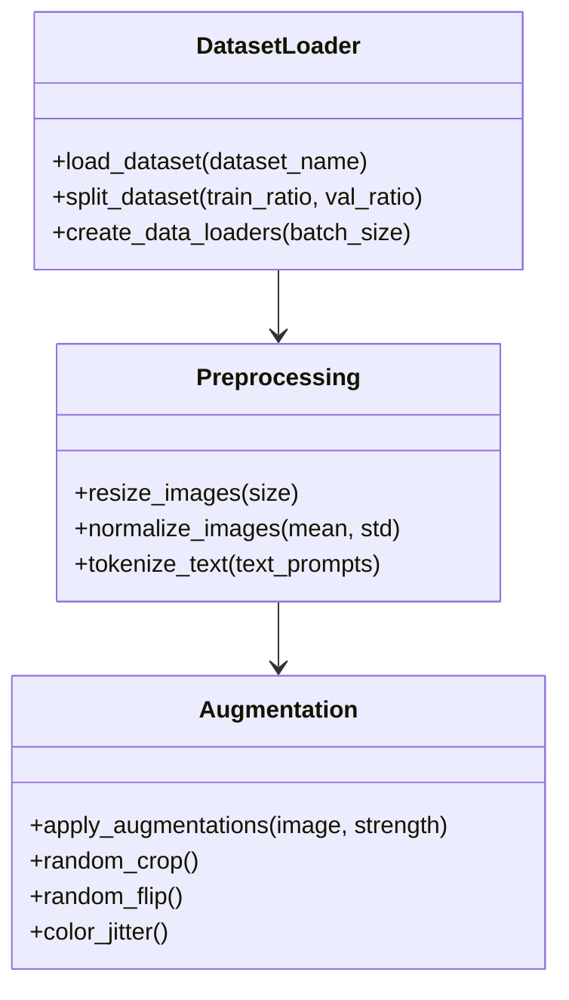

Key components:
- **Dataset Loader**: Handles loading and splitting datasets
- **Preprocessing**: Responsible for image resizing, normalization, and text tokenization
- **Augmentation**: Implements various data augmentation techniques

### 2. Model Layer

The model layer defines the neural network architecture.

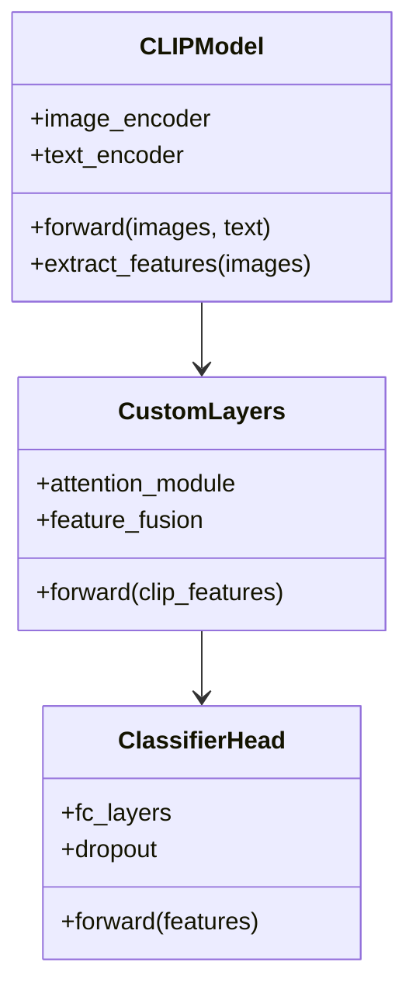

Key components:
- **CLIP Model**: Provides pre-trained image and text encoders
- **Custom Layers**: Extends CLIP with task-specific functionality
- **Classifier Head**: Maps features to action classes

### 3. Training Layer

The training layer orchestrates model training processes.

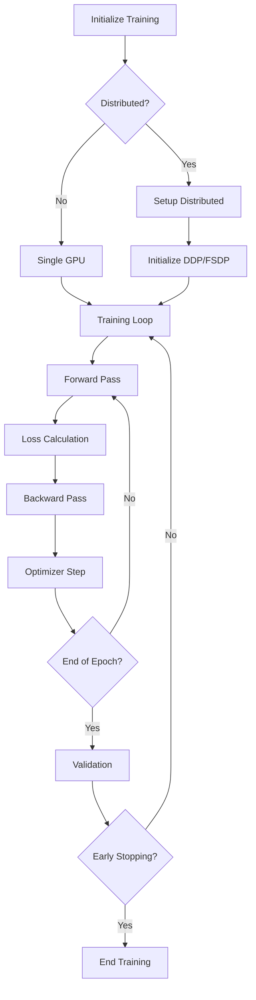

Key components:
- **Distributed Training**: Support for DistributedDataParallel (DDP) and FullyShardedDataParallel (FSDP)
- **Training Loop**: Manages iterations, epochs, and validation
- **Optimization**: Implements learning rate scheduling and gradient clipping

### 4. Evaluation Layer

The evaluation layer assesses model performance.

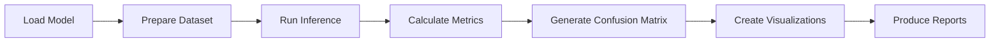

Key components:
- **Metrics Calculation**: Computes accuracy, precision, recall, F1 score
- **Confusion Matrix**: Visualizes class prediction performance
- **Reporting**: Generates comprehensive evaluation reports

### 5. MLOps Layer

The MLOps layer handles experiment tracking and model management.

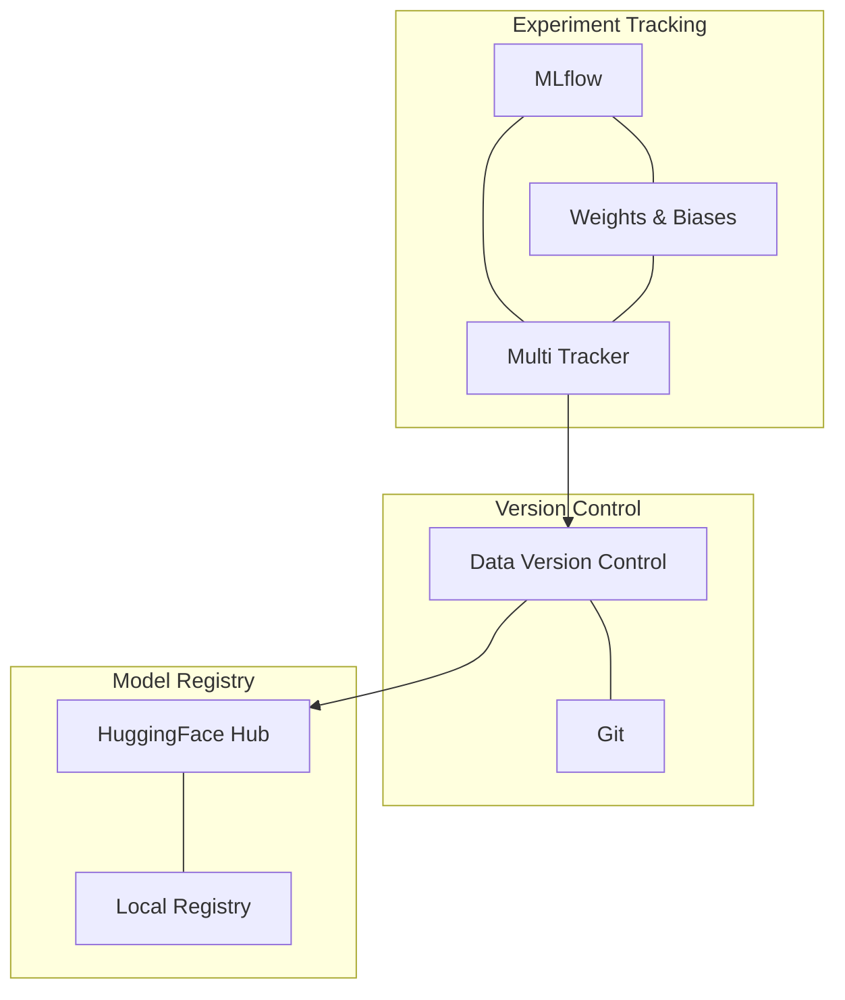

Key components:
- **Unified Tracking**: Supports both MLflow and Weights & Biases
- **DVC Integration**: Manages dataset and model versioning
- **HuggingFace Hub**: Facilitates model sharing and distribution

### 6. Deployment Layer

The deployment layer prepares models for production use.

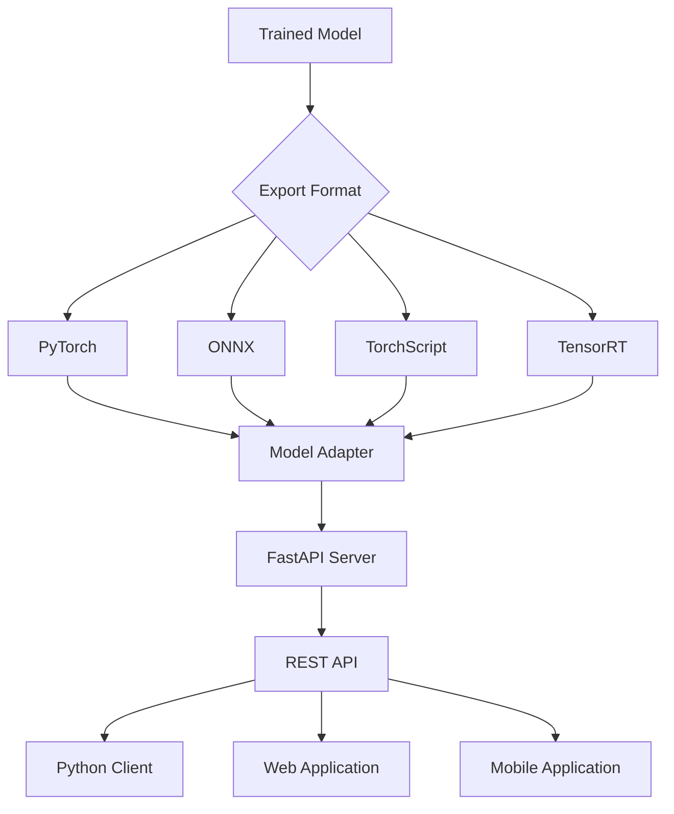

Key components:
- **Model Export**: Converts models to various formats (ONNX, TensorRT)
- **Inference Server**: FastAPI-based API for model serving
- **Adapters**: Unified interface for different model formats

### 7. Application Layer

The application layer provides user interfaces.

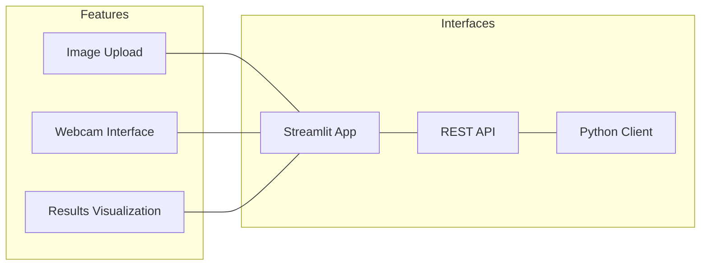

Key components:
- **Streamlit App**: Interactive web interface for model testing
- **REST API**: Endpoints for model inference
- **Python Client**: Programmatic access to model functionality

## Data Flow

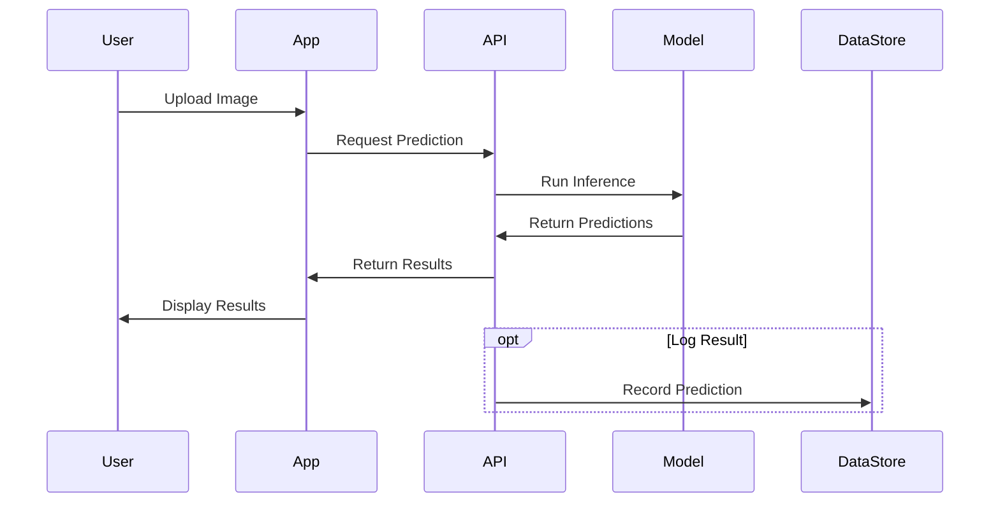

## Deployment Architecture

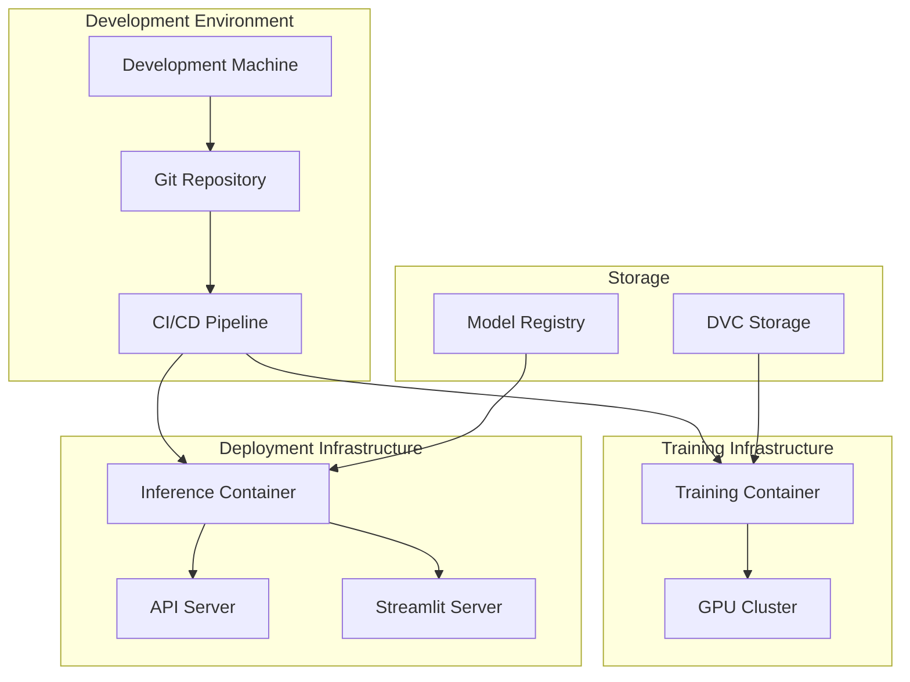

## Module Dependencies

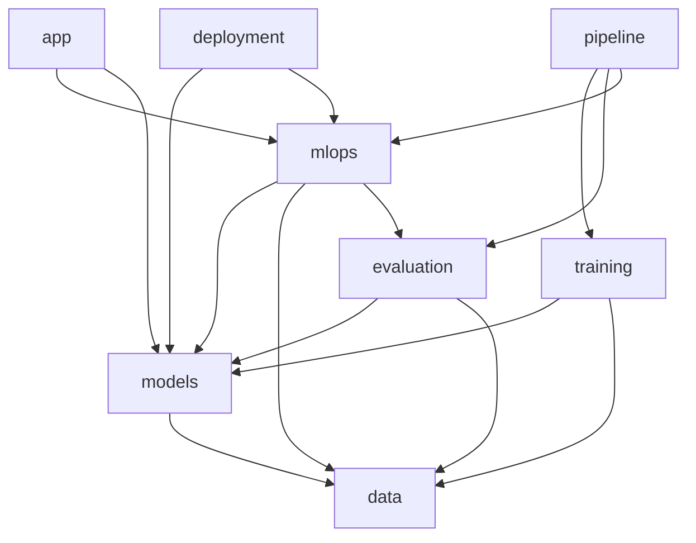

## Scalability and Performance

The system is designed for scalability and performance:

1. **Distributed Training**: Support for multi-GPU and multi-node training
2. **Model Optimization**: Export to optimized formats for inference 
3. **Containerization**: Docker containers for consistent deployment
4. **API Design**: Asynchronous endpoint processing for high throughput

## Security Considerations

The system implements several security measures:

1. **Authentication**: API access control
2. **Data Privacy**: Input data sanitization
3. **Model Protection**: Access control for model artifacts
4. **Container Security**: Minimal base images and dependency scanning
