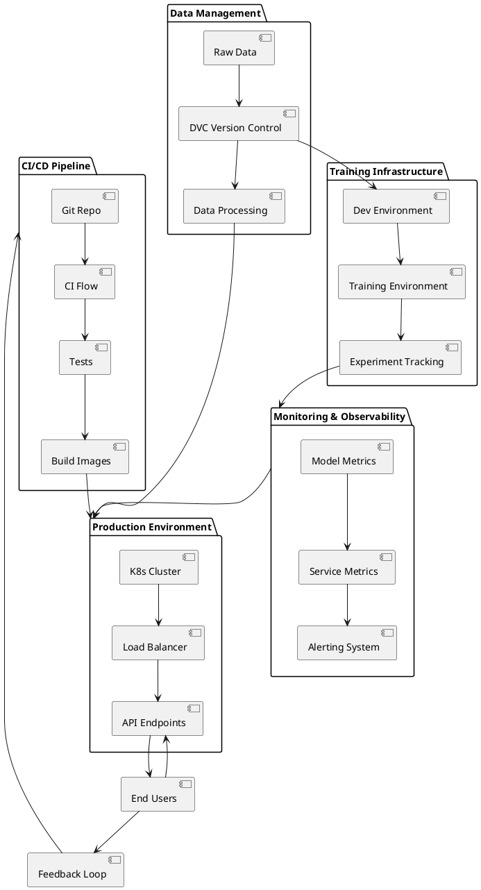
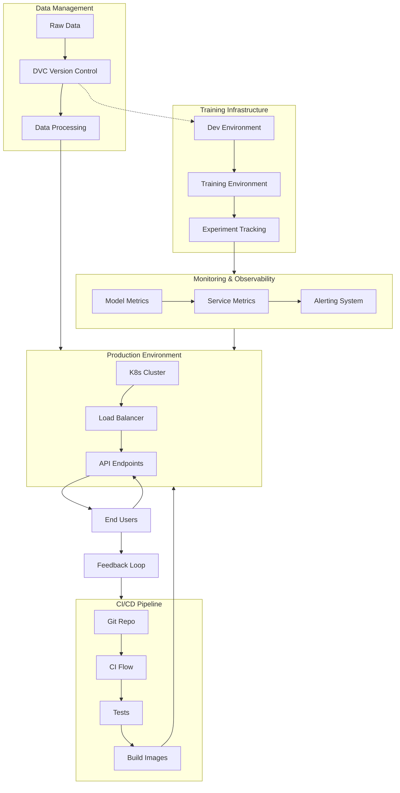

# Better Diagram Options for Architecture Documentation

The current ASCII diagrams in the architecture documentation are functional but not visually appealing. Here are better alternatives that maintain compatibility across different Markdown viewers:

## 1. PlantUML Diagrams

[PlantUML](https://plantuml.com/) is a widely supported diagram format that can be embedded in Markdown. Many Markdown viewers and documentation systems support it.

Example of the System Integration diagram using PlantUML:



## 2. Mermaid (Using Proper Syntax)

If Mermaid is preferred but not rendering correctly in some viewers, a more standardized approach can help. Many platforms now support Mermaid diagrams:



## 3. Simplified ASCII with Better Spacing

If ASCII diagrams must be used, here's a cleaner, simplified version with better spacing:

```
┌───────────────────┐     ┌──────────────────────┐     ┌────────────────┐
│  DATA MANAGEMENT  │     │  TRAINING INFRA      │     │  CI/CD PIPELINE │
│                   │     │                      │     │                │
│  ┌─────┐  ┌─────┐ │     │  ┌─────┐  ┌─────┐   │     │  ┌─────┐ ┌────┐│
│  │ RAW ├─>│ DVC │ │=====>  │ DEV ├─>│TRAIN│   │     │  │ GIT ├>│ CI ││
│  └─────┘  │STORE│ │     │  │ ENV │  │ ENV │   │     │  │REPO │ │FLOW││
│           └─────┘ │     │  └─────┘  └─────┘   │     │  └─────┘ └────┘│
│              │    │     │             │       │     │           │    │
│              ▼    │     │             ▼       │     │           ▼    │
│         ┌────────┐│     │        ┌────────┐  │     │       ┌───────┐│
│         │  DATA  ││     │        │TRACKING│  │     │       │ TESTS ││
│         │PROCESS ││     │        └────────┘  │     │       └───────┘│
│         └────────┘│     │                    │     │           │    │
└───────────────────┘     └──────────────────────┘     │       ┌───────┐│
        │                         │                     │       │ BUILD ││
        │                         │                     │       │IMAGES ││
        │                         │                     │       └───────┘│
        │                         │                     └────────────────┘
        │                         │                             │
        ▼                         ▼                             ▼
┌───────────────────┐     ┌──────────────────────┐
│  PRODUCTION ENV   │<────│ MONITORING & METRICS │
│                   │     │                      │
│  ┌─────┐  ┌─────┐ │     │  ┌─────┐  ┌─────┐   │
│  │ K8S ├─>│LOAD │ │     │  │MODEL├─>│SERV │   │
│  │CLUST│  │BALAN│ │     │  │METR │  │METR │   │
│  └─────┘  └─────┘ │     │  └─────┘  └─────┘   │
│      │       │    │     │               │     │
│      ▼       ▼    │     │               ▼     │
│   ┌────────────┐  │     │         ┌─────────┐ │
│   │API ENDPOINT│  │     │         │ ALERTS  │ │
│   └────────────┘  │     │         └─────────┘ │
│         ▲         │     │                     │
└─────────┼─────────┘     └──────────────────────┘
          │                          │
          │                          │
          ▼                          │
    ┌──────────┐                     │
    │END USERS │                     │
    └──────────┘                     │
                                     │
          ┌───────────────────────────┘
          │
          ▼
    FEEDBACK LOOP
```

## 4. Use GitHub Wiki or Documentation Sites

For the most polished presentation:

1. Move the architecture documentation to GitHub Wiki or a documentation site like GitHub Pages with Jekyll or mkdocs
2. Use proper diagramming tools that are supported in these environments
3. Link to the external documentation from the README

## Recommendations

1. **For GitHub Markdown Files**: Use the simplified ASCII or PlantUML approach
2. **For External Documentation**: Set up GitHub Pages with Mermaid or other diagram support
3. **For the Most Compatible Approach**: Use the simplified ASCII art with proper spacing and alignment

If visual appeal is the highest priority, I recommend setting up a documentation site with mkdocs or GitHub Pages where you can embed proper diagrams while maintaining your code in the repository. 